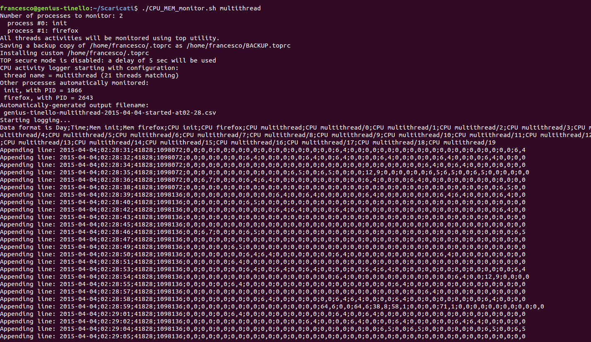
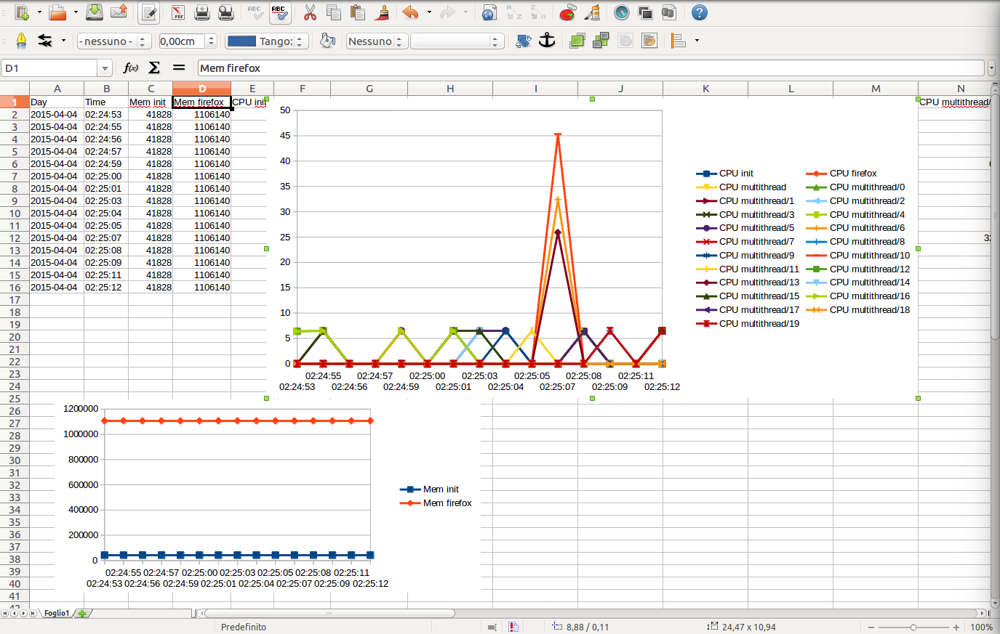

# CPU-MEM-monitor
CPU-MEM-monitor is a simple script to monitor Linux CPU and memory usage over time and output a CSV report 
that can be easily analysed and plotted with e.g., Excel or OpenOffice Calc.

More in details, this script allows to monitor per-thread CPU usage and memory usage by parsing 
in an automated way the output of <a href="http://linux.die.net/man/1/top">TOP</a> or 
<a href="http://sebastien.godard.pagesperso-orange.fr/index.html">PIDSTAT</a> utilities.

The script is focused on monitoring the CPU (by thread) and memory usage (by process) of one or more Linux
processes over time. This is very useful to optimize programs that need to be running for long amounts of
time (e.g., servers) or to ensure that no memory leaks are present in your software.
The use of regular expressions make it easy to capture CPU/memory usage of strongly-multithreaded applications.
The output is written in an Excel-friendly (or OpenOffice-friendly!) .CSV file whose contents can be easily 
plotted with few clicks.

The script is all contained in a single file so that it is very easy to copy and move around Linux machines.
It only requires BASH, TOP (or PIDSTAT) and other common utility programs (like GREP and AWK) installed.

The script is also useful to analyze a (multithreaded) process during a long amount of time (e.g., several days / months).
For such usage scenario it is convenient to use the <a href="https://www.linode.com/docs/networking/ssh/using-gnu-screen-to-manage-persistent-terminal-sessions">screen utility</a>.


# Command Line Interface

The script accepts the following command-line options:

```
    Usage: ./CPU_MEM_monitor_v11.sh [-h] [-v] [--use-pidstat] [-t THREADNAME_REGEX] [-p AUX_PROCESS1] [-p AUX_PROCESS2] ...
    Version 1.1, by Francesco Montorsi
    Automates TOP/PIDSTAT monitoring and resource usage statistics logging to a .CSV file
      -h              this help
      -v              be verbose
      --use-pidstat   pidstat rather than top will be used
      -t <tregex>     monitor threads whose name match the regex <tregex>; e.g. 'mythread\|myotherthread'
      -p <auxproc>    monitor CPU and memory usage of the auxiliary process <auxproc>
    Default option values:
      VERBOSE: false
      USEPIDSTAT: false
      THREADNAME_REGEX: myparworker\|threadtype2
      AUX_PROCESS #0: multithread
      Output .csv file name will be automatically generated based on current date and hostname.
      Associated to the .csv also a .log file containing info messages will be generated.

    DIFFERENCES BETWEEN AUXILIARY PROCESS MONITORING AND THREAD MONITORING:
      Auxiliary process monitoring collects per-process CPU% and MEMORY values.
      Thread monitoring collects per-thread CPU% and MEMORY values.

      If a monitored aux process dies, the script will attempt to restart logging process completely.
      If a monitored thread ends, the script will do nothing and continue logging.
```


# Example Run

As an example, assume you want to monitor a process called "multithread" that generates several threads
named "myparworker/0", "myparworker/1", etc or "threadtype2/0", "threadtype2/1", etc
(such example program is available as an example in the "docs" folder); 
in this case you can launch the CPU_MEM_monitor script as:

<tt>
    $ ./CPU_MEM_monitor.sh -t "myparworker\|operation2thread" -p multithread
</tt>

which will produce:



The .csv file produced by above example can be downloaded
<a href="docs/ubuntu-multithread-2015-04-04-started-at02-28.csv">clicking here</a>.

The .csv file can be easily plotted to get an idea of the thread CPU usage and the per-process memory used:




# How To Install

```
    $ wget http://raw.githubusercontent.com/f18m/CPU-MEM-monitor/master/CPU_MEM_monitor.sh
    $ chmod a+x CPU_MEM_monitor.sh                      # ensure execute permissions
    $ sudo mv CPU_MEM_monitor.sh  /usr/local/bin        # make it available system-wide
```

# How To Use

```
    $ screen              # in case you want to leave logging after closing terminal screen
    $ CPU_MEM_monitor.sh -t yourThreadName -p yourProcessName
    [CTRL+A, D]         # to detach from the screen session and leave the script running
```

After the session of performance logging is completed, just double-click the .csv file created in
the directory where the script has been launched and analyse the logged CPU/memory values.


# Other Utilities

The "decimate_compress_csv.sh" script available from:

```
    $ wget http://raw.githubusercontent.com/f18m/CPU-MEM-monitor/master/decimate_compress_csv.sh
    $ chmod a+x decimate_compress_csv.sh        # ensure execute permissions
    $ sudo mv decimate_compress_csv.sh  /usr/local/bin
```

can be used to decimate very large .csv files (e.g., generated after several days of logging),
to ease manipulation by e.g. Excel.

